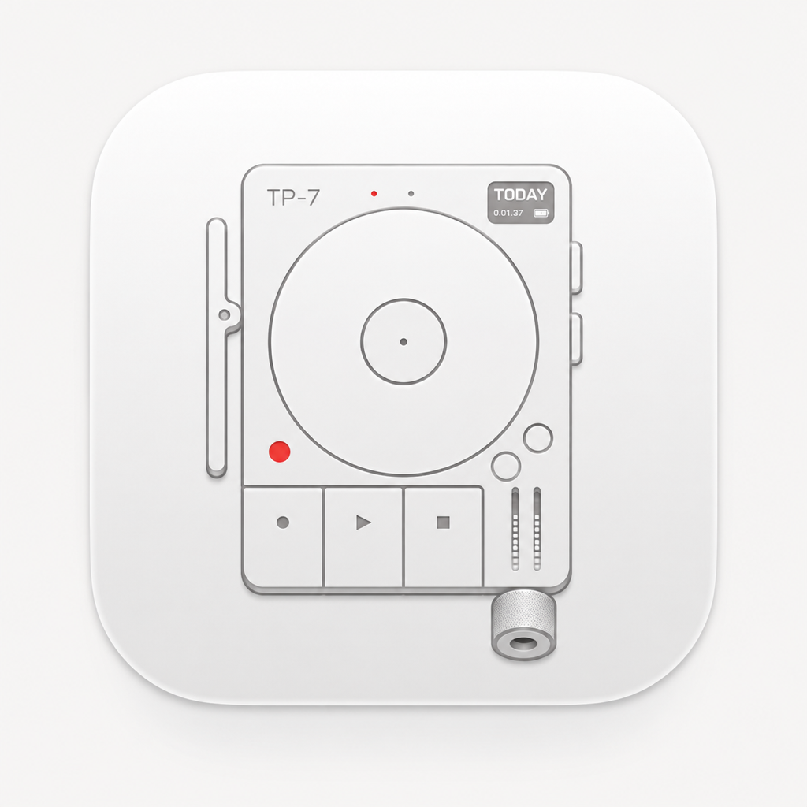

# TP7 Vibe Deck

TP7 Vibe Deck is a native macOS control deck for Teenage Engineering TP-7. It turns the TP-7's physical buttons, side controls, wheel, audio input, and MIDI events into a configurable command surface for creative work, dictation, coding, and hardware workflows.



## Product Preview


The app provides a live TP-7 device view, connection status, MIDI event history, recording controls, mapping profiles, wheel tuning, and quick actions from one focused macOS interface.

## Why It Is Native

- **Real macOS app:** SwiftUI and AppKit, with no Electron shell or browser runtime.
- **Direct hardware access:** CoreMIDI reads TP-7 controller events and AVFoundation opens its audio input directly.
- **Low-latency interaction:** MIDI events are normalized in the app and dispatched to native macOS actions.
- **Local by default:** device state, mappings, recordings, and control dispatch stay on the Mac.
- **Open and inspectable:** the complete SwiftPM source, model assets, MIDI evidence, safety notes, and build scripts are included.

## Features

- TP-7 audio and MIDI connection monitoring.
- Confirmed REC, PLAY, STOP, wheel, side-control, and learned-input handling.
- Persistent mapping profiles for Open Speech, keyboard commands, scroll, volume, brightness, and custom shortcuts.
- Menu bar extra for quick status and commands.
- SceneKit TP-7 model with clickable control hotspots.
- TP-7 audio warmup to reduce first-recording latency.
- Microphone and Accessibility permission entry points with live status refresh.
- MIDI recovery when macOS invalidates a CoreMIDI connection.
- JSON MIDI capture utility for hardware calibration and regression evidence.
- Optional Open Speech preset and shortcut integration; the controller remains useful without it.

## Architecture

```text
TP-7 USB audio + CoreMIDI
          |
          v
  TP7DeviceMonitor / TP7MIDIListener
          |
          v
    TP7MappingProfile
          |
          v
  Native action adapters
  (shortcuts, Return, scroll, volume, brightness, recording)
```

The mapping layer is deliberately separate from device discovery and action dispatch. That makes it possible to add another controller or a future SEM adapter without changing the TP-7 event protocol.

## Technology Stack

| Layer | Technology |
| --- | --- |
| App UI | SwiftUI, AppKit, macOS menu bar extra |
| Package/build | Swift 5.9+, Swift Package Manager |
| Audio | AVFoundation, CoreAudio |
| MIDI | CoreMIDI |
| 3D device view | SceneKit, USDZ, GLB, SceneKit assets |
| Native actions | CoreGraphics, AppKit, ServiceManagement |
| Persistence | UserDefaults and JSON mapping profiles |
| Distribution | macOS app bundle, DMG packaging, code-sign verification |

## Download

Download the latest **TP7 Vibe Deck** DMG from the [GitHub Releases page](https://github.com/PacoZhou1/tp7-vibe-deck/releases/latest).

The release also includes the dated source archive used to build the reference app. The DMG is the standalone macOS app; the repository source is the editable SwiftPM project.

## Build From Source

Requirements:

- macOS 14 or newer.
- Xcode Command Line Tools or Xcode with Swift 5.9 or newer.
- A Teenage Engineering TP-7 for hardware validation. The app can still build and open without one connected.

Build and stage the app bundle:

```bash
./script/build_and_run.sh bundle
```

Build and launch it:

```bash
./script/build_and_run.sh run
```

Create a local DMG:

```bash
./script/package_dmg.sh "$PWD/dist/TP7VibeDeck.dmg"
```

The scripts use the product name `TP7 Vibe Deck`, bundle identifier `com.paco.TP7VibeInput`, and minimum macOS version 14.0.

## TP-7 Setup

For controller events, put the TP-7 into `MODE -> MIDI -> ctrl`. In the confirmed setup:

- REC emits CC 22.
- PLAY emits CC 23.
- STOP emits CC 24.
- The wheel emits relative CC 30 data.

Read [TP7_MIDI_PROTOCOL.md](docs/TP7_MIDI_PROTOCOL.md) for the complete protocol and [tp7-midi-map.json](docs/tp7-midi-map.json) for the machine-readable map. Use [SEM_CONTROL_SAFETY.md](docs/SEM_CONTROL_SAFETY.md) before connecting any microscope control adapter.

## Privacy And Safety

TP7 Vibe Deck does not require a cloud service. Hardware status, mappings, MIDI events, and recordings are handled locally. The Open Speech bridge only reads the explicitly documented local defaults domain and posts local notifications.

The included SEM documents are integration guidance, not a vendor SDK or authorization to operate a microscope. Keep live instrument commands behind an explicit adapter and simulated mode while testing.

## Asset Attribution

The bundled TP-7 model is `Teenage engineering tp 7` by Denis Nikolaichuk on BlenderKit / Blendkit:
<https://www.blendkit.com/asset-gallery-detail/034033a1-1f83-46f4-ba49-f26cd83c6149/>

The model was converted to SceneKit assets for native macOS rendering. The original GLB is retained in the source package for provenance.

## Open Source

This project is released under the MIT License. The model asset and any linked third-party content remain subject to their own licenses and attribution requirements.

Contributions are welcome around MIDI normalization, mapping profiles, native macOS interaction, device recovery, accessibility, and safe hardware adapters.
