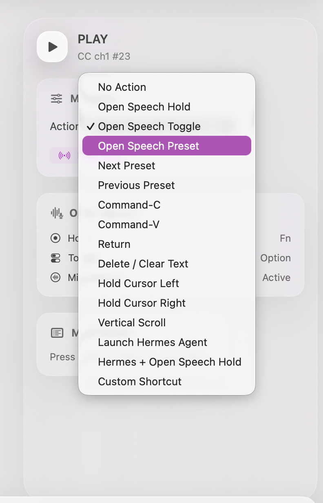
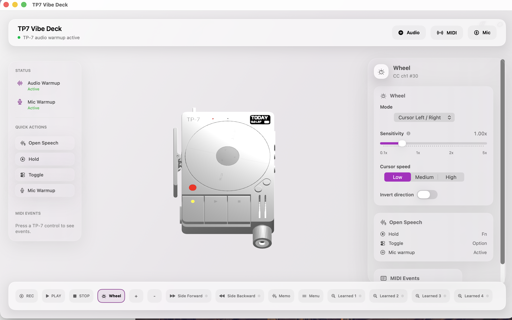
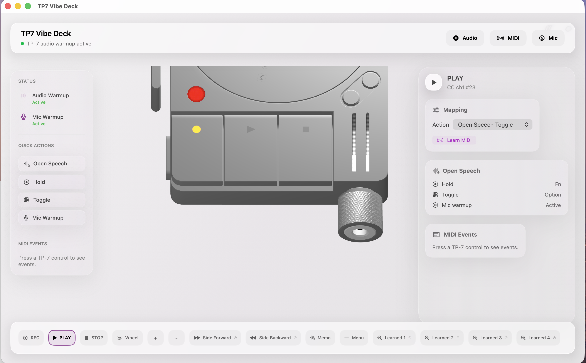

# Open Speech ASR

Open Speech ASR is a native macOS voice-input app for turning speech into clean text anywhere you can type. It is an open-source continuation of the OpenSpeech/FreeFlow line, rebuilt around a local Apple Silicon pipeline: the app, recognition, correction, and privacy boundary live on your Mac.

The core promise is simple: speak, get polished text, keep your data on your Mac.


## Product Preview

Open Speech can be mapped into a hardware or automation workflow through configurable shortcuts and presets:



The repository also includes the companion TP-7 Vibe Deck workflow. These screenshots show the optional controller console, not the core Open Speech speech engine:





## Why It Is Different

- **macOS-native experience**: Swift, SwiftUI, AppKit, AVAudioEngine, global shortcuts, menu-bar controls, Keychain storage, and native accessibility integration.
- **Local by default**: the default ASR and correction path runs on the Mac. Audio and transcripts do not need to leave the device.
- **Native ASR inference**: Qwen3-ASR runs inside the Swift process through MLX Swift and `speech-swift`, with a precompiled Metal shader library for fast Apple GPU inference.
- **Local text correction**: bundled Gemma E4B applies prompt presets, punctuation, vocabulary, and output-language rules locally through the optional bundled MLX backend.
- **Replaceable engines**: users can choose `Qwen3-ASR + Gemma E4B`, `SenseVoice + Gemma E4B`, or a configured third-party API.
- **Designed for repeated dictation**: model lifecycle control, cache cleanup, combined memory budgeting, stale-process protection, and a first-run setup flow are built into the app.

Local-first does not mean provider-blind. When `第三方 API` mode is selected, audio or text is sent to the endpoint configured by the user. That mode is explicit and separate from the local modes.

## Native + Local by Design

“Native” means this is a real macOS application, not an Electron shell or a browser wrapper. The menu-bar app, recording path, global shortcuts, permissions, pasteboard, settings, and secure credential storage use Swift, SwiftUI, AppKit, AVAudioEngine, macOS Input Monitoring, and Keychain APIs.

“Local” means the default product path does not require an Open Speech account, developer-operated server, telemetry pipeline, or cloud transcription service. Qwen3-ASR runs in the Swift process through MLX Swift and Metal; optional Gemma correction runs from the bundled local backend on the same Mac. The only exception is the clearly labelled third-party API mode, which is opt-in and sends data only to the provider configured by the user.

## Features

- System-wide dictation into the active text field.
- Chinese and English transcription with Qwen3-ASR 1.7B 4-bit.
- Local Gemma E4B correction with editable prompt presets.
- Custom vocabulary and context-aware cleanup.
- Output-language conversion when requested by the selected prompt.
- Three engine modes with synchronized frontend and backend state.
- Configurable global shortcuts and microphone selection.
- First-run guidance for microphone, Input Monitoring, shortcut, and transcription setup.
- Memory cleanup at the combined local MLX budget and a guarded restart fallback at the hard limit.
- Optional OpenAI-compatible third-party transcription and LLM endpoints.

## Architecture

```text
Microphone
   |
   v
Swift / AVAudioEngine / Qwen3ASRProvider
   |  Qwen3-ASR inference in-process via MLX Swift
   v
Raw transcript
   |
   +--> local Gemma E4B correction (optional, bundled backend)
   |
   +--> third-party API correction (explicit user-selected mode)
   v
Clean text pasted into the active macOS application
```

The default Qwen path does not load SenseVoice. The legacy `SenseVoice + Gemma E4B` option remains available for compatibility. The local correction backend listens on `127.0.0.1:8001` and is started only when a local Gemma mode needs it.

## Technology Stack

| Layer | Technology |
| --- | --- |
| App shell | Swift 5.10, SwiftUI, AppKit, Swift Package Manager |
| Audio and input | AVAudioEngine, macOS Accessibility APIs, global shortcut handling |
| Native ASR | `speech-swift` `Qwen3ASR`, MLX Swift, Qwen3-ASR 1.7B 4-bit |
| GPU runtime | Apple Metal through MLX, precompiled `mlx.metallib` |
| Local correction | Bundled Python 3.13 runtime, MLX-based Gemma E4B backend, Uvicorn/FastAPI endpoints |
| Secure settings | macOS Keychain and UserDefaults for non-secret preferences |
| Distribution | Developer ID signing, Apple notarization, stapled DMG |

## Requirements

- macOS 15 or newer.
- Apple Silicon Mac recommended for local MLX inference.
- Microphone and Input Monitoring permissions for full dictation behavior; Screen Recording is optional for context-aware features.
- About 8GB or more of available memory for Qwen3-ASR plus local Gemma correction.

The model weights are intentionally not committed to this repository. The release DMG contains the tested model bundle; source builds must provide model directories locally.

## Build From Source

Install Xcode Command Line Tools and Swift Package Manager dependencies, then provide the local Qwen model directory:

```bash
make all \
  QWEN3_ASR_MODEL_SOURCE=/path/to/Qwen3-ASR-1.7B-4bit \
  BACKEND_RUNTIME_SOURCE=/path/to/compatible/backend-runtime
```

The Qwen directory must contain `model.safetensors`, `vocab.json`, and `merges.txt`. The backend runtime directory must contain the Python runtime and any local Gemma model resources expected by `backend/inference_server.py`.

The build invokes `scripts/build_mlx_metallib.sh` and places the resulting `mlx.metallib` beside the app executable. Do not skip shader precompilation: without it, MLX can fall back to runtime shader compilation and inference can become several times slower.

Run the native ASR smoke test against a real audio file:

```bash
swift build -c release --disable-sandbox
.build/release/asr-smoke-test path/to/audio.aiff /path/to/Qwen3-ASR-1.7B-4bit zh
```

Create a local package:

```bash
make dmg \
  QWEN3_ASR_MODEL_SOURCE=/path/to/Qwen3-ASR-1.7B-4bit \
  BACKEND_RUNTIME_SOURCE=/path/to/compatible/backend-runtime
```

For distribution signing, set `CODESIGN_IDENTITY` to a Developer ID Application identity. The release workflow additionally uses `xcrun notarytool` and `stapler`.

## Download

Use the [latest GitHub Release](https://github.com/PacoZhou1/open-speech-asr/releases/latest) for the notarized macOS build and release notes.

The full local model bundle is larger than GitHub's 2GiB per-release-asset limit, so the DMG is published as numbered parts with a SHA-256 file. Download every `Open-Speech-ASR.dmg.part-*` asset into one directory and join them in lexical order:

```bash
cat Open-Speech-ASR.dmg.part-* > "Open-Speech-ASR.dmg"
shasum -a 256 -c Open-Speech-ASR.dmg.sha256
```

## Privacy

Local modes keep recognition and correction on the Mac. API mode is opt-in and uses the endpoint, model, and credentials configured by the user. API credentials are stored through the macOS Keychain rather than committed to the repository.

This repository does not include model weights, personal settings, signing certificates, notarization credentials, or user audio.

## Open Source

The project is released under the MIT License. Contributions are welcome, especially around native macOS input behavior, MLX memory management, model-provider abstractions, permissions, and packaging.

Please read [LICENSE](LICENSE) before redistributing the application or its bundled model files. Model weights and third-party libraries remain subject to their own licenses and terms.

## Known Limitation

The current local correction backend uses `127.0.0.1:8001`. If another local service already owns that port, quit the conflicting service before starting a local Gemma mode. Dynamic backend-port allocation is a planned follow-up.
